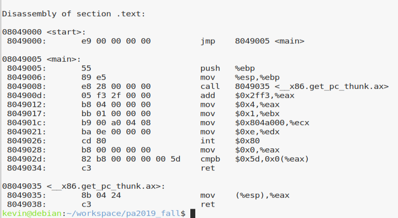
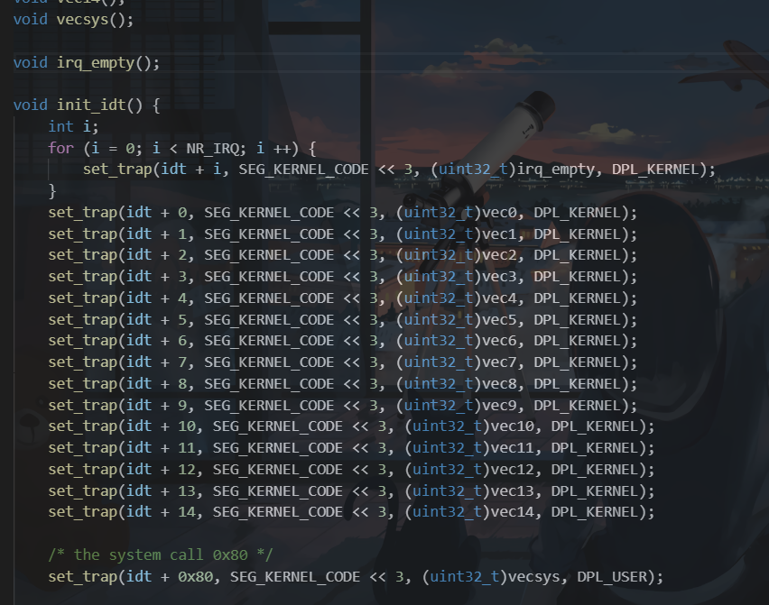
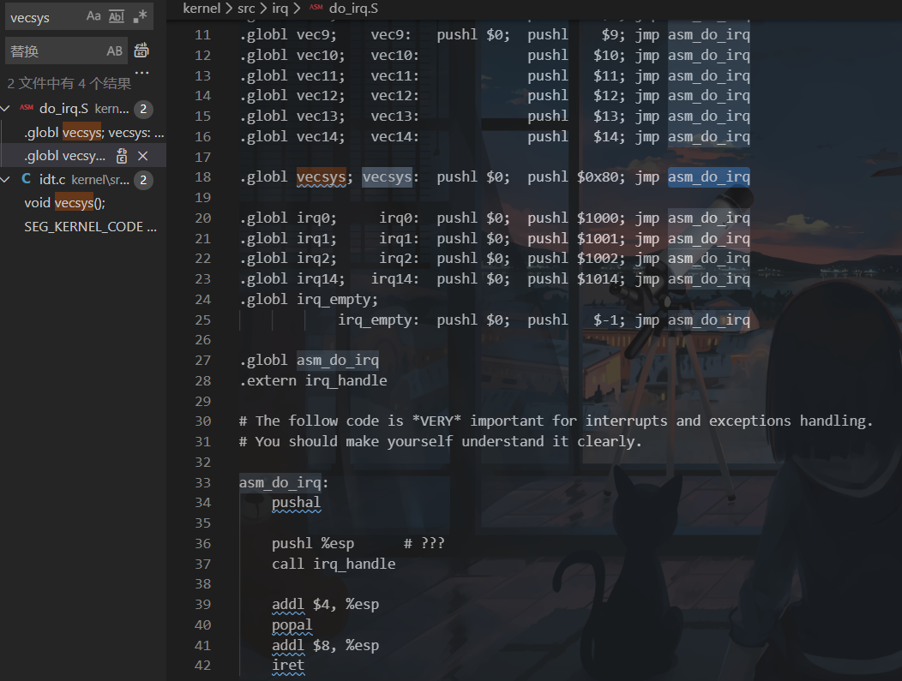
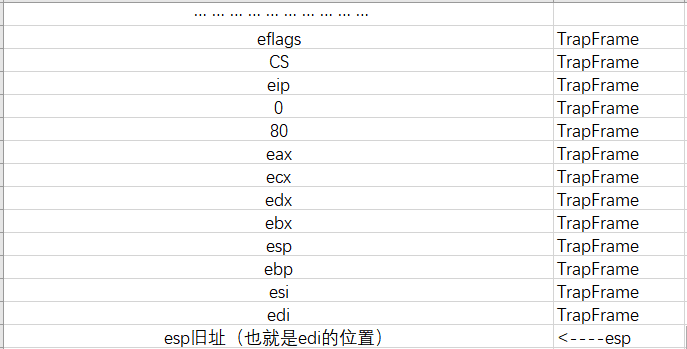

# PA4实验报告

181860077 佘帅杰

### PA4_1

##### 问题1：详细描述测试样例中int80开始到hit_good_trap的系统行为

反汇编看看测试样例：



首先是处理int指令，int指令会读取对应的中断号（比如说int 80的“80”，然后80作为参数被传递给了raise_sw_intr函数。到达了raise_sw_intr函数，这个函数就是把eip加上2（到达下一条指令的开始）然后调用raise_intr函数，参数就是传进来的中断号。这个时候达到了额raise_intr函数，参数是中断号80，在这个函数里会进行现场的保存（把当前的状态寄存器Eflags，以及cs寄存器，还有eip进行压栈），接着查看是否需要关中断，最后根据传入的中断号计算出对应处理程序地址，然后对eip进行跳转赋值



这个可以看到在一开始的init的时候，就有一个set_trap函数来初始化中断向量表，也同时很容易就发现了80对应的trap设置，对应的参数（函数）是vecsys，那么也就是前文所说的跳转地址是和这个参数是有关系的，查看对应set_trap的实现验证想法

```c
static void set_trap(GateDesc *ptr, uint32_t selector, uint32_t offset, uint32_t dpl) {
	ptr->offset_15_0 = offset & 0xFFFF;
	ptr->segment = selector;
	ptr->pad0 = 0;
	ptr->type = TRAP_GATE_32;
	ptr->system = 0;
	ptr->privilege_level = dpl;
	ptr->present = 1;
	ptr->offset_31_16 = (offset >> 16) & 0xFFFF;
}

```

可以看到函数vecsys作为参数offset传入，然后赋值到了offset_31_16和offset_15_0上，这里也验证了上文所说的计算处理程序eip的函数的计算原理。



然后根据线索又找到了vecsys的实现位置，可以发现就是push \$0，然后push ​\$80，最后跳转到asm_do_irq，至此，经过了一系列的跳转，达到了asm_do_irq。然后发现这个就在下面，分析这个函数的功能（暂时成为函数）。就是调用了这个阶段所实现的pusha，然后使用push %esp（也就是下面的问题的根源），然后是call irq_handle函数，接着看看下面就是恢复栈帧结构和现场，最后iret跳转回去。那就来到irq_handle。

显然在call之前的这个push很有问题，其实就是利用栈帧传参，看到了irq_handle函数刚刚好有一个预设的参数TrapFrame。那么问题就解决了，就是把pusha的最后的esp，也就是TrapFrame的指针传参了。然后就是irq_handle的内部实现，对参数进行一些判断，然后处理中断。结束后的返回，然后如上一段的解释回到原程序。处理结束。

##### 问题2：在这个过程里回答push %esp有什么作用，画出call irq_hadle之前系统栈的内容和esp的位置，指出TrapFrame对应系统栈的哪一段内容

如上题末尾所述，push就是在传参数，前面刚好调用了pusha，然后esp也就是前面push了一堆东西的地址，把这个地址压栈，就是把前面一堆东西的地址作为指针进行传参，刚好参数是TrapFrame类型，也就是

```c
typedef struct TrapFrame {
	uint32_t edi, esi, ebp, xxx, ebx, edx, ecx, eax;	// GPRs
	int32_t irq;										// #irq
	uint32_t error_code;								// error code
	uint32_t eip, cs, eflags;							// execution state saved by hardware
} TrapFrame;

```



根据上文的分析和截图，可以看到在raise_intr里进行了eflags，cs，还有eip的保存，也就是最早的三个数据，然后是vecsys里对0和80的压栈（这里的0和80对应TrapFrame的error_code和irq），然后asm_do_irq里使用pusha，保存了大量寄存器，最后push %esp就是传参给irq_handle。栈帧结构如上图所示。TrapFrame就是在栈里标注的部分，通过对照TrapFrame的结构体定义得到验证。

### PA4_2

##### 问题1：注册监听事件是怎么完成的？

注意到这里对于这个键盘输入的测试样例是echo，所以对testcase的echo.c进行分析。

首先，注意到有一个函数是in_byte，功能是从端口读入一个字节的数据，也从函数体的内容可以猜到（如下）

```c
asm volatile("in %1, %0": "=a"(data) : "d"(port));
```

然后是add_irq_handle，这个函数是为了把Keyboard_event_handler和键盘输入的中断异常处理程序进行绑定，也就是注册监听事件，具体的函数体如下（handler是处理程序指针）

```c
asm volatile("int $0x80" : : "a"(0), "b"(irq), "c"(handler));
```

然后对于出现了int \$80，一路找到do_syscall.c，发现了如下代码（节选）

```c
void do_syscall(TrapFrame *tf) 
{
	switch(tf->eax) 
    {
		case 0: 
			cli();
			add_irq_handle(tf->ebx, (void*)tf->ecx);
			sti();
			break;
		case SYS_brk: sys_brk(tf); break;
		case SYS_open: sys_open(tf); break;
```

那么对应处理的时候，显然由上文汇编可以知道，eax=0，然后再由上文PA4-1中分析，TrapFrame的eax就是0，也就是会有调用add_irq_handle。再接着找add_irq_handle，找到了如下：

```c
void add_irq_handle(int irq, void (*func)(void) ) 
{
	assert(irq < NR_HARD_INTR);
	assert(handle_count <= NR_IRQ_HANDLE);

	struct IRQ_t *ptr;
	ptr = &handle_pool[handle_count ++]; /* get a free handler */
	ptr->routine = func;
	ptr->next = handles[irq]; /* insert into the linked list */
	handles[irq] = ptr;
}
```

在异常处理的“池子”里找到空的，然后进行插入，func就是被一路传递的Keyboard_event_handler。

##### 问题2：从键盘按下一个键到控制台输出对应的的字符，系统的执行过程是什么？

在上文的处理之后，已经有了对应的异常处理程序。按下键盘，再有异常出现调用处理函数就会落在Keyboard_event_handler，然后对应的函数里调用in_byte（in_byte函数是一条内联汇编代码，调用in指令，in指令接着调用pio_read，把读取的结果放在eax里，data在内联汇编里接受了eax的值，也就是返回值），然后转化键码，最后printc，其实就是又嵌套调用writec，如下

```c
asm volatile("int $0x80" : : "a"(SYS_write), "b"(fd), "c"(&c), "d"(1));
```

显然int \$80来到do_syscall，这个时候就不会再落在add_irq_handle里了，而是对应的去找sys_write

```c
static void sys_write(TrapFrame *tf) 
{
	tf->eax = fs_write(tf->ebx, (void*)tf->ecx, tf->edx);
}
```

然后顺着fs_write找，就是一层层的调用，最后找到了serial_printc，再最后来到了out_byte，往后找就是调用了out指令的内联汇编了。在out指令里再往后还有pio_write，调用的其实也是pio对应的一个处理函数（结构体成员）

```c
static struct pio_handler_map {
	uint16_t port;
	pio_handler handler;
} pio_handler_table [] = { 

```

到了这里处理结束，完成工作